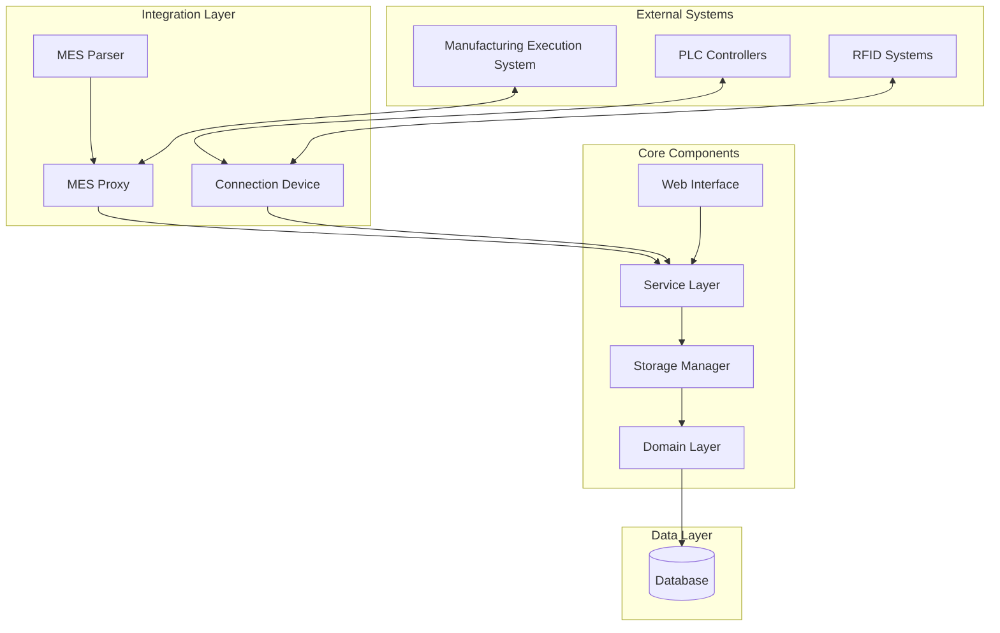
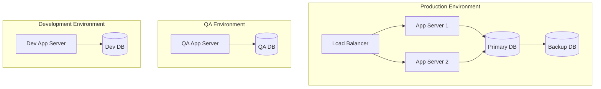

# AHM Stamp Storage System Overview

## Project Purpose

The AHM Stamp Storage System is an automated storage and retrieval system designed to manage stamping dies and carriers in Honda's manufacturing facilities. The system provides:

- Automated tracking and management of stamping dies and carriers
- Integration with Manufacturing Execution System (MES)
- Real-time monitoring and control of storage operations
- Optimization of storage space utilization
- Support for production planning and scheduling

## Target Audience

- Manufacturing Operations Personnel
- Production Planners
- Maintenance Teams
- System Administrators
- Quality Control Teams

## Core Value Proposition

1. **Operational Efficiency**
   - Automated carrier tracking and routing
   - Optimized storage space utilization
   - Reduced manual handling and human error
   - Improved production throughput

2. **Quality Control**
   - Real-time tracking of die locations and status
   - Automated validation of carrier movements
   - Integration with quality control systems
   - Complete audit trail of all operations

3. **Cost Reduction**
   - Minimized equipment idle time
   - Reduced labor costs
   - Optimized inventory management
   - Preventive maintenance scheduling

## System Architecture

## Key Features

### 1. Storage Management
- Automated carrier tracking
- Dynamic storage allocation
- Space optimization algorithms
- Real-time inventory management

### 2. Production Integration
- MES integration
- Production schedule synchronization
- Work order management
- Quality control integration

### 3. Equipment Control
- PLC communication
- RFID integration
- Automated conveyor control
- Safety system integration

### 4. Monitoring & Reporting
- Real-time system status
- Performance analytics
- Audit trail
- Custom report generation

## Technical Stack

### Backend
- Java Enterprise Edition
- Spring Framework
- Hibernate ORM
- Apache ActiveMQ

### Frontend
- Java Server Pages (JSP)
- JavaScript
- HTML5/CSS3
- jQuery

### Database
- IBM DB2

### Integration
- Custom PLC protocols
- MES integration protocols
- RFID communication protocols

## System Requirements

### Hardware
- Application Server: 
  - CPU: 4+ cores
  - RAM: 16GB minimum
  - Storage: 100GB+ SSD
- Database Server:
  - CPU: 8+ cores
  - RAM: 32GB minimum
  - Storage: 500GB+ SSD

### Software
- JDK 8 or higher
- WebSphere Application Server
- DB2 Database Server
- Red Hat Enterprise Linux

### Network
- Gigabit Ethernet
- Redundant connections
- Low latency (<10ms)

## Security Model

### Authentication
- LDAP integration
- Role-based access control
- Multi-factor authentication support
- Session management

### Authorization
- Granular permission system
- Operation-level access control
- Audit logging
- Security event monitoring

## Deployment Architecture

## Integration Points

### 1. Manufacturing Execution System (MES)
- Production order management
- Quality data exchange
- Material tracking
- Process control

### 2. PLC Systems
- Real-time equipment control
- Status monitoring
- Safety system integration
- Error handling

### 3. RFID Systems
- Carrier identification
- Location tracking
- Movement validation
- Inventory reconciliation

## Performance Metrics

### System Performance
- Response time: <500ms
- Transaction throughput: >100/sec
- System availability: 99.9%
- Data accuracy: 99.999%

### Business Metrics
- Storage utilization
- Order fulfillment rate
- Equipment efficiency
- Error reduction

## Disaster Recovery

### Backup Strategy
- Real-time database replication
- Daily full backups
- Transaction log backups
- Offsite backup storage

### Recovery Procedures
- System restoration procedures
- Data recovery processes
- Business continuity plans
- Emergency response protocols

## Support Model

### Level 1 Support
- Basic user assistance
- Simple troubleshooting
- Issue logging
- Initial problem assessment

### Level 2 Support
- Technical issue resolution
- System monitoring
- Performance tuning
- Regular maintenance

### Level 3 Support
- Complex problem resolution
- Root cause analysis
- System optimization
- Architecture improvements

## Future Roadmap

### Short Term (0-6 months)
- Performance optimization
- UI/UX improvements
- Additional reporting features
- Security enhancements

### Medium Term (6-12 months)
- AI/ML integration
- Predictive maintenance
- Mobile application
- Cloud integration

### Long Term (12+ months)
- Full system modernization
- Advanced analytics
- IoT integration
- Digital twin implementation
