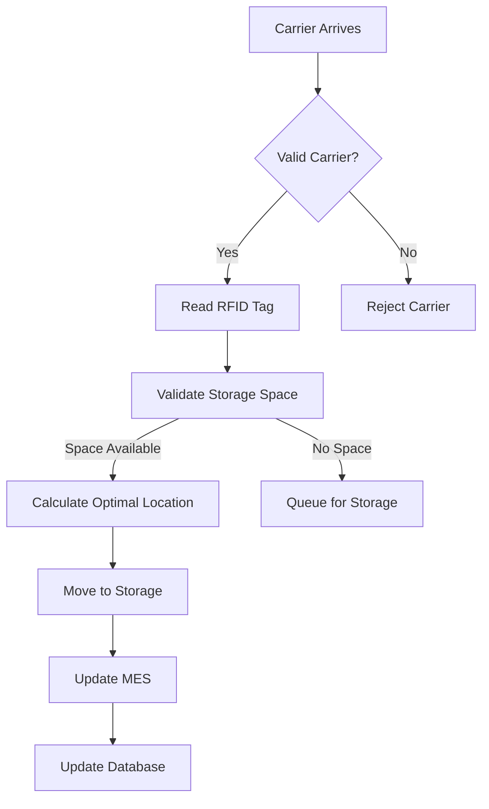
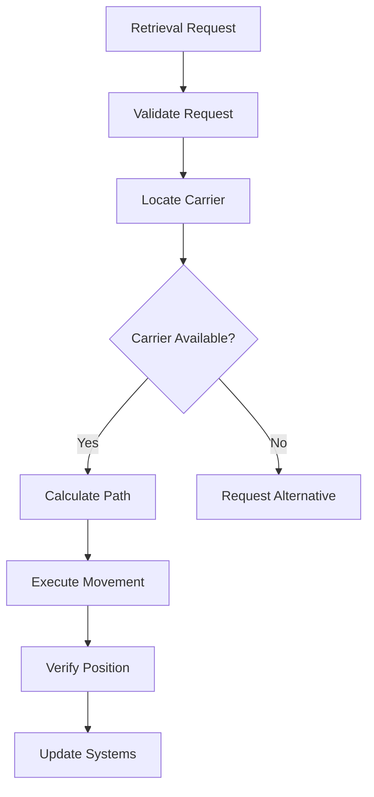
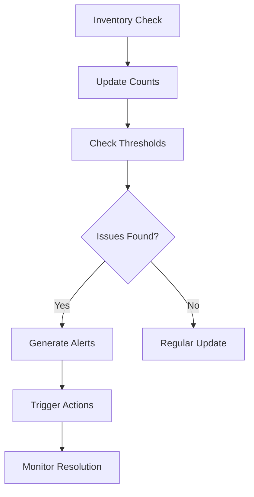
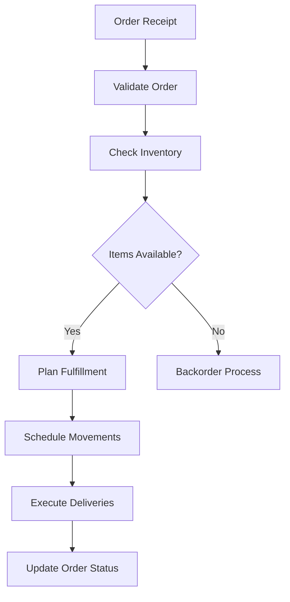
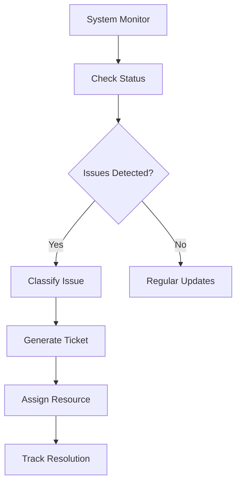

# Business Processes Documentation

## Core Processes Overview

The AHM Stamp Storage System manages several critical business processes related to stamp storage and movement. This document details the key processes, their workflows, and implementation details.

## 1. Carrier Storage Process

### Overview
Process for receiving and storing carriers in the storage system.



### Implementation Details
```java
@Service
public class CarrierStorageService {
    @Autowired
    private StorageManager storageManager;
    
    @Autowired
    private RfidReader rfidReader;
    
    @Transactional
    public StorageResult storeCarrier(String carrierId) {
        // Validate carrier
        // Read RFID
        // Find storage location
        // Execute movement
        // Update systems
    }
}
```

### Key Steps
1. Carrier Validation
   - Check carrier ID
   - Verify physical dimensions
   - Validate content type

2. Location Assignment
   - Check available space
   - Apply storage rules
   - Optimize location selection

3. Movement Execution
   - Generate movement commands
   - Monitor movement progress
   - Verify final position

4. System Updates
   - Update MES status
   - Record storage location
   - Update inventory counts

## 2. Carrier Retrieval Process

### Overview
Process for retrieving carriers from storage based on production demands.



### Implementation Details
```java
@Service
public class CarrierRetrievalService {
    @Autowired
    private StorageManager storageManager;
    
    @Transactional
    public RetrievalResult retrieveCarrier(String carrierId, String destination) {
        // Validate request
        // Find carrier
        // Plan movement
        // Execute retrieval
        // Update systems
    }
}
```

### Key Steps
1. Request Validation
   - Verify authorization
   - Check destination validity
   - Validate timing constraints

2. Carrier Location
   - Query current position
   - Check carrier status
   - Verify accessibility

3. Movement Planning
   - Calculate optimal path
   - Check for obstacles
   - Reserve movement path

4. Execution
   - Send movement commands
   - Monitor progress
   - Confirm completion

## 3. Inventory Management Process

### Overview
Continuous process for managing and optimizing storage inventory.



### Implementation Details
```java
@Service
public class InventoryManagementService {
    @Autowired
    private StorageManager storageManager;
    
    @Scheduled(fixedRate = 300000) // Every 5 minutes
    public void performInventoryCheck() {
        // Count inventory
        // Check thresholds
        // Generate reports
        // Trigger actions
    }
}
```

### Key Steps
1. Regular Checks
   - Count physical inventory
   - Verify system records
   - Check storage utilization

2. Threshold Monitoring
   - Check capacity limits
   - Monitor usage patterns
   - Track dwell times

3. Action Triggers
   - Generate alerts
   - Initiate movements
   - Request maintenance

## 4. Order Fulfillment Process

### Overview
Process for managing and fulfilling production orders.



### Implementation Details
```java
@Service
public class OrderFulfillmentService {
    @Autowired
    private StorageManager storageManager;
    
    @Transactional
    public FulfillmentResult processOrder(OrderRequest request) {
        // Validate order
        // Check availability
        // Plan movements
        // Execute fulfillment
    }
}
```

### Key Steps
1. Order Processing
   - Validate requirements
   - Check priorities
   - Verify timing

2. Resource Allocation
   - Check availability
   - Reserve resources
   - Plan movements

3. Execution
   - Schedule movements
   - Monitor progress
   - Update status

## 5. Maintenance Process

### Overview
Process for system maintenance and error handling.



### Implementation Details
```java
@Service
public class MaintenanceService {
    @Autowired
    private SystemMonitor systemMonitor;
    
    @Scheduled(fixedRate = 60000) // Every minute
    public void checkSystemHealth() {
        // Monitor systems
        // Detect issues
        // Generate alerts
        // Track resolution
    }
}
```

### Key Steps
1. System Monitoring
   - Check components
   - Monitor performance
   - Track errors

2. Issue Management
   - Classify problems
   - Assign resources
   - Track resolution

3. Reporting
   - Generate reports
   - Update stakeholders
   - Document solutions

## Error Handling

### 1. Communication Errors
```java
@Component
public class ErrorHandler {
    public void handleDeviceError(DeviceException e) {
        // Log error
        // Notify operators
        // Initiate recovery
    }
}
```

### 2. Movement Errors
```java
@Component
public class MovementErrorHandler {
    public void handleMovementError(MovementException e) {
        // Stop movement
        // Log error
        // Notify operators
    }
}
```

## Process Monitoring

### 1. Performance Metrics
```java
@Component
public class ProcessMonitor {
    public void trackMetrics() {
        // Monitor timing
        // Track success rates
        // Generate reports
    }
}
```

### 2. Status Reporting
```java
@Component
public class StatusReporter {
    public void generateReport() {
        // Collect data
        // Format report
        // Distribute results
    }
}
```

## Integration Points

### 1. MES Integration
```java
@Component
public class MesIntegration {
    public void synchronizeStatus() {
        // Update MES
        // Verify sync
        // Log results
    }
}
```

### 2. PLC Integration
```java
@Component
public class PlcIntegration {
    public void sendCommand(PlcCommand cmd) {
        // Format command
        // Send to PLC
        // Verify execution
    }
}
```

## Process Optimization

### 1. Performance Analysis
- Monitor execution times
- Track success rates
- Identify bottlenecks
- Optimize paths

### 2. Resource Utilization
- Track storage usage
- Monitor system load
- Optimize movements
- Balance workload
