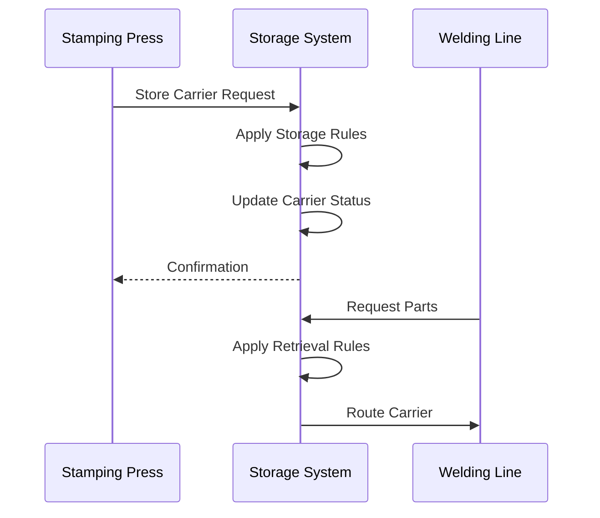

# Stamp Storage System Technical Documentation

## Project Overview

The Stamp Storage System is an industrial automation system designed to manage and control the movement and storage of stamped parts carriers in Honda's manufacturing facility. The system coordinates the flow of carriers between stamping presses, storage areas, and welding lines while maintaining inventory tracking and process control.

## System Architecture

### Core Components

1. **Domain Layer**
   - Core business entities and logic
   - JPA/Hibernate persistence
   - Key domain objects:
     - Carrier: Represents physical carriers that transport stamped parts
     - Die: Represents stamping dies used in the manufacturing process
     - StorageRow: Represents storage locations in the facility
     - Stop: Represents physical stops/stations in the conveyor system

2. **Storage Management Layer**
   - Handles carrier routing and storage logic
   - Implements storage rules and strategies
   - Key components:
     - Storage: Main interface for storage operations
     - StorageState: Maintains current system state
     - StoreInManager: Handles storage intake logic
     - StoreOutManager: Handles retrieval logic

3. **Device Integration Layer**
   - Manages communication with physical devices
   - Supports multiple protocols:
     - MES (Manufacturing Execution System) integration
     - PLC (Programmable Logic Controller) communication
     - RFID device integration

### Database Structure

1. **Core Tables**
   ```sql
   CREATE TABLE [dbo].[CarrierInfo] (
       [CarrierInfo_ID] [numeric](18,0) IDENTITY(1,1),
       [CarrierNumber] [numeric](18,0),
       [DieNumber] [numeric](18,0),
       [Quantity] [int],
       [Model] [nchar](10),
       [Type] [nchar](10),
       [InTimestamp] [datetime],
       [OutTimestamp] [datetime]
   )

   CREATE TABLE [dbo].[StampingStatus] (
       [StampingStatus_ID] [numeric](18,0) IDENTITY(1,1),
       [CarrierNumber] [numeric](18,0),
       [CurrentDestination] [varchar](10),
       [RequestedDestination] [varchar](10),
       [InTimestamp] [datetime],
       [OutTimestamp] [datetime]
   )
   ```

2. **Audit Tables**
   - CarrierInfoAudit: Tracks carrier information changes
   - StampingStatusAudit: Tracks status changes

## Business Logic

### Carrier Management

1. **Carrier States**
   - Tracks carrier location, contents, and status
   - Maintains carrier maintenance information
   - Manages carrier movement between locations

2. **Storage Rules**
   - Determines optimal storage locations
   - Handles carrier routing logic
   - Manages storage area capacity

### Process Flow



## Integration Points

1. **MES Integration**
   - Receives production orders
   - Reports carrier status
   - Tracks part inventory

2. **PLC Communication**
   - Controls physical carrier movement
   - Monitors conveyor system status
   - Manages stop positions

3. **RFID System**
   - Tracks carrier locations
   - Verifies carrier identity
   - Validates routing decisions

## Security and Monitoring

1. **Audit Trail**
   - All carrier movements logged
   - Status changes tracked
   - System events recorded

2. **Error Handling**
   - Invalid carrier detection
   - Communication failure recovery
   - System state validation

## System Configuration

1. **Storage Areas**
   - Multiple storage zones
   - Configurable capacity limits
   - Priority-based allocation

2. **Routing Rules**
   - Customizable routing logic
   - Production line priorities
   - Emergency routing options

## Performance Considerations

1. **Optimization**
   - Minimizes carrier movement
   - Balances storage utilization
   - Prioritizes critical paths

2. **Scalability**
   - Supports multiple storage areas
   - Handles concurrent operations
   - Maintains performance under load

## Maintenance Procedures

1. **System Health**
   - Regular state validation
   - Performance monitoring
   - Error rate tracking

2. **Recovery Procedures**
   - State recovery process
   - Communication restoration
   - Data consistency checks
